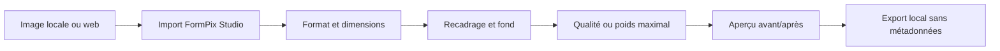
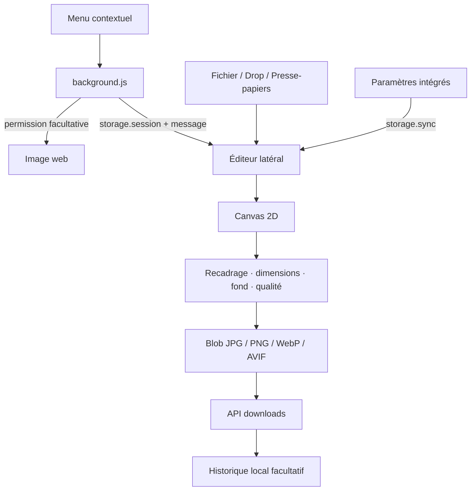

<div align="center">
  
  <h1>FormPix Studio</h1>
  <p><strong>Préparez n’importe quelle image pour un formulaire, un réseau social ou un site web — directement dans votre navigateur.</strong></p>
  <p>Extension locale, privée et multiplateforme pour Chrome et Firefox.</p>

  <p>
    
    
    
    
    
    
  </p>

  <p>
    <a href="#installation-locale">Installation</a> ·
    <a href="#fonctionnalités">Fonctionnalités</a> ·
    <a href="#architecture-technique">Architecture</a> ·
    <a href="#confidentialité-et-sécurité">Confidentialité</a> ·
    <a href="https://github.com/SDINAHET/FormPix_Studio/issues">Signaler un problème</a>
  </p>
</div>

---

## À propos

**FormPix Studio** est une extension de préparation d’images développée par [Stéphane Dinahet](https://github.com/SDINAHET). Elle réunit dans une barre latérale les opérations habituellement dispersées entre plusieurs outils : import depuis une page web, recadrage, redimensionnement, conversion, transparence, contrôle du poids et export.

Le traitement est réalisé avec les API natives du navigateur. L’image n’est envoyée ni au développeur ni à un service tiers : aucun serveur applicatif, compte utilisateur, outil d’analyse d’audience ou script distant n’est nécessaire.

> **Positionnement :** FormPix Studio n’est pas seulement un menu « Enregistrer l’image sous ». C’est un atelier local permettant de satisfaire des contraintes précises de format, de dimensions et de poids avant un téléversement.

## Sommaire

- [Fonctionnalités](#fonctionnalités)
- [Parcours utilisateur](#parcours-utilisateur)
- [Compatibilité Chrome et Firefox](#compatibilité-chrome-et-firefox)
- [Installation locale](#installation-locale)
- [Utilisation](#utilisation)
- [Formats et transparence](#formats-et-transparence)
- [Autorisations](#autorisations)
- [Confidentialité et sécurité](#confidentialité-et-sécurité)
- [Internationalisation](#internationalisation)
- [Architecture technique](#architecture-technique)
- [Développement et packaging](#développement-et-packaging)
- [Plan de validation](#plan-de-validation)
- [Limites connues](#limites-connues)
- [Feuille de route](#feuille-de-route)
- [Contribution et assistance](#contribution-et-assistance)

## Fonctionnalités

### Import et intégration navigateur

- Sélecteur de fichiers avec sélection multiple.
- Glisser-déposer dans la barre latérale.
- Collage depuis le presse-papiers.
- Import depuis le menu contextuel d’une image web.
- Ouverture automatique de FormPix Studio au clic droit.
- Remplacement immédiat de l’aperçu non enregistré par la dernière image sélectionnée.
- Protection contre les courses réseau : une ancienne requête lente ne peut pas remplacer la sélection la plus récente.

### Édition et préparation

- Recadrage visuel par glisser-déposer.
- Largeur et hauteur exactes jusqu’à 12 000 px.
- Verrouillage du ratio d’origine.
- Modes **Ajuster**, **Remplir et recadrer** et **Étirer**.
- Comparaison rapide entre l’original et le résultat.
- Fond transparent, blanc ou couleur personnalisée.
- Suppression déterministe d’un fond blanc uni avec tolérance et adoucissement des contours.

### Conversion et optimisation

- Export **JPG**, **PNG**, **WebP** et **AVIF**.
- Détection explicite de la capacité d’encodage AVIF du navigateur.
- Qualité distincte par format avec perte.
- Cibles instantanées : **100 Ko**, **500 Ko**, **1 Mo** ou valeur personnalisée.
- Recherche automatique de la meilleure qualité sous la limite demandée.
- Réduction facultative des dimensions lorsque la qualité seule ne suffit pas.
- Suppression des métadonnées EXIF et autres métadonnées sources lors du réencodage.

### Productivité

- Préréglages pour formulaire, photo de profil, Full HD, Instagram, Story/Reel, LinkedIn, YouTube, Open Graph et bannière web.
- File d’attente et conversion de plusieurs images.
- Horodatage des noms activé par défaut pour éviter les écrasements.
- Choix du dialogue « Enregistrer sous » et d’un sous-dossier de téléchargements.
- Historique local facultatif limité aux métadonnées d’export.
- Ouverture d’un fichier récent dans la visionneuse par défaut de Windows ou Linux.
- Export et import des paramètres au format JSON.

### Expérience et accessibilité

- Interface sombre responsive conçue pour une barre latérale étroite.
- Paramètres intégrés sans perte de l’image en cours.
- La roue dentée devient une flèche de retour pendant l’affichage des paramètres.
- État des traitements, erreurs et limites de poids affichés dans l’interface.
- 20 langues et sens droite-à-gauche pour l’arabe.

## Parcours utilisateur



## Compatibilité Chrome et Firefox

Le dépôt contient deux paquets autonomes partageant le même cœur fonctionnel.

| Cible | Dossier | Barre latérale | Arrière-plan | Version minimale | État |
|---|---|---|---|---:|---|
| Chrome, Chromium, Edge, Brave | [`chrome/`](chrome/) | `sidePanel` | Service worker MV3 | Chrome 116 | Version principale |
| Firefox | [`firefox/`](firefox/) | `sidebar_action` | Background script MV3 | Firefox 121 | Variante à valider avant signature AMO |

Le manifeste Firefox déclare l’identifiant Gecko `formpix-studio@sdinahet.github.io`. Les différences de plateforme sont limitées au manifeste et à l’ouverture de la barre latérale ; l’éditeur, les options, les langues et le pipeline de conversion restent communs.

## Installation locale

### Chrome et navigateurs Chromium

1. Cloner ou télécharger le dépôt.
2. Ouvrir `chrome://extensions`.
3. Activer **Mode développeur**.
4. Cliquer sur **Charger l’extension non empaquetée**.
5. Sélectionner le dossier [`chrome/`](chrome/).
6. Épingler FormPix Studio si nécessaire.

Après une modification, cliquer sur **Actualiser** dans `chrome://extensions` puis recharger la page web utilisée pour le test.

### Firefox

1. Ouvrir `about:debugging#/runtime/this-firefox`.
2. Cliquer sur **Charger un module complémentaire temporaire**.
3. Sélectionner [`firefox/manifest.json`](firefox/manifest.json).
4. Ouvrir FormPix Studio depuis son icône ou le menu des barres latérales.

Une extension temporaire est supprimée au redémarrage de Firefox. Une installation permanente exige un paquet signé par [Mozilla Add-ons](https://addons.mozilla.org/developers/).

## Utilisation

### Préparer une image depuis une page web

1. Faire un clic droit sur l’image.
2. Choisir **Ouvrir dans FormPix Studio**, **Préparer l’image en…** ou **Ouvrir et copier en PNG**.
3. Accepter l’autorisation de site lorsqu’elle est demandée.
4. La barre latérale s’ouvre et importe la sélection.
5. Régler le format, les dimensions, le recadrage, le fond, la qualité ou le poids maximal.
6. Vérifier le résultat puis télécharger l’image.

### Préparer des fichiers locaux

Glisser plusieurs images sur l’écran d’accueil ou utiliser **Choisir une image**. Les réglages actifs sont appliqués à la file d’attente lors du traitement groupé.

### Changer d’image sans enregistrer

Sélectionner simplement une autre image depuis la page web ou le sélecteur de fichiers. Le nouvel aperçu remplace le précédent sans téléchargement imposé ni boîte de confirmation.

## Formats et transparence

| Format | Transparence | Compression | Usage conseillé |
|---|---:|---|---|
| JPG | Non | Avec perte | Photographies et formulaires exigeant un fichier léger |
| PNG | Oui | Sans perte | Logos, captures, interfaces et images transparentes |
| WebP | Oui | Avec perte | Ressources web modernes et développeurs |
| AVIF | Selon le navigateur | Avec perte | Compression avancée lorsque l’encodage est disponible |

Un export JPG compose toujours les pixels transparents sur le fond choisi. La suppression de fond intégrée cible une couleur blanche uniforme ; elle ne constitue pas une segmentation par intelligence artificielle.

## Autorisations

FormPix Studio applique le principe du moindre privilège et explique chaque autorisation dans l’interface.

| Autorisation | Justification |
|---|---|
| `storage` | Préférences synchronisées et historique local facultatif |
| `sidePanel` — Chrome | Affichage de l’éditeur dans la barre latérale |
| `contextMenus` | Actions disponibles au clic droit sur une image |
| `downloads` | Export avec nom, sous-dossier et ouverture depuis l’historique |
| `clipboardWrite` | Action explicite « Ouvrir et copier en PNG » |
| Hôtes HTTP/HTTPS facultatifs | Récupération de l’image choisie par l’utilisateur |

Deux stratégies d’accès web sont proposées :

- **Autoriser une fois pour tous les sites** : une demande globale facultative, puis des imports automatiques.
- **Demander pour chaque nouveau site** : permission limitée au domaine de l’image et mémorisée par le navigateur.

Changer vers le mode site par site retire l’autorisation globale. Les permissions peuvent également être révoquées depuis les paramètres du navigateur.

## Confidentialité et sécurité

### Garanties

- Traitement des pixels entièrement local.
- Aucun serveur FormPix Studio.
- Aucun compte ou profil utilisateur.
- Aucune publicité, télémétrie ou analyse d’audience.
- Aucune vente ni transmission de données.
- Aucun code JavaScript distant.
- Communications HTTPS uniquement pour récupérer une image explicitement sélectionnée.
- Réencodage Canvas supprimant les métadonnées sources.

### Données conservées

Les préférences sont enregistrées dans le profil du navigateur. Lorsque l’historique est activé, une entrée peut contenir le nom du fichier, la source, la date, le format, les dimensions, le poids et l’identifiant local du téléchargement. Les pixels ne sont jamais copiés dans l’historique.

Consulter les politiques complètes :

- [Politique Chrome](chrome/PRIVACY.md)
- [Politique Firefox](firefox/PRIVACY.md)

## Internationalisation

La langue du navigateur est utilisée par défaut. Un choix manuel peut être mémorisé dans les paramètres.

Langues disponibles : allemand, anglais, arabe, chinois simplifié, coréen, espagnol, français, hindi, indonésien, italien, japonais, néerlandais, polonais, portugais du Brésil, russe, suédois, thaï, turc, ukrainien et vietnamien.

Deux mécanismes complémentaires sont utilisés :

- `_locales/<locale>/messages.json` pour le nom, la description et les libellés natifs de l’extension ;
- `i18n.js` pour le choix manuel et la traduction de l’interface embarquée.

## Architecture technique



### Structure du dépôt

```text
FormPix_Studio/
├── README.md
├── chrome/
│   ├── manifest.json
│   ├── background.js
│   ├── editor.html / editor.js / styles.css
│   ├── options.html / options.js / options.css
│   ├── i18n.js / _locales/
│   ├── icons/ / icon.svg / logo-master.png
│   ├── PRIVACY.md
│   └── STORE_LISTING.md
└── firefox/
    └── mêmes composants avec un manifeste Firefox dédié
```

### Principes d’implémentation

- Manifest V3.
- JavaScript natif sans framework.
- Aucune dépendance d’exécution.
- Aucune étape de compilation.
- Canvas 2D pour le rééchantillonnage et le réencodage.
- `storage.sync` pour les préférences, `storage.local` pour l’historique et `storage.session` pour la communication temporaire.
- Identifiant de sélection pour garantir que la dernière image choisie reste prioritaire.

## Développement et packaging

### Prérequis

- Un navigateur Chrome 116+ ou Firefox 121+.
- Aucun gestionnaire de paquets requis.

### Contrôles statiques rapides

```bash
node --check chrome/background.js
node --check chrome/editor.js
node --check chrome/options.js
node --check chrome/i18n.js
python3 -m json.tool chrome/manifest.json > /dev/null
```

Répéter ces contrôles pour le dossier `firefox/`.

### Créer les archives de soumission

Depuis la racine du dépôt :

```bash
(cd chrome && zip -r ../formpix-studio-chrome-v0.5.1.zip . -x '*.DS_Store')
(cd firefox && zip -r ../formpix-studio-firefox-v0.5.1.zip . -x '*.DS_Store')
```

Le contenu du dossier navigateur doit se trouver à la racine de l’archive : `manifest.json` ne doit pas être enfermé dans un sous-dossier supplémentaire.

## Plan de validation

Avant toute publication, vérifier manuellement :

- [ ] ouverture de la barre latérale depuis l’icône ;
- [ ] import par fichier, glisser-déposer et presse-papiers ;
- [ ] import HTTPS depuis chaque action du menu contextuel ;
- [ ] refus puis acceptation des permissions ;
- [ ] modes global et site par site ;
- [ ] remplacement rapide de plusieurs images ;
- [ ] conservation d’un canal alpha PNG/WebP ;
- [ ] composition correcte d’un JPG sur fond blanc ou personnalisé ;
- [ ] dimensions exactes et verrouillage du ratio ;
- [ ] recadrage visuel en mode Remplir ;
- [ ] cible automatique de 500 Ko ;
- [ ] export groupé ;
- [ ] horodatage et sous-dossier ;
- [ ] actualisation immédiate des statistiques ;
- [ ] ouverture d’un fichier depuis l’historique ;
- [ ] export/import des paramètres ;
- [ ] choix manuel des langues et interface arabe RTL ;
- [ ] retour depuis les paramètres sans perte de l’image ;
- [ ] support AVIF ou message d’indisponibilité explicite.

## Limites connues

- Les URL temporaires `blob:` appartenant à une page ne sont pas toujours récupérables depuis le processus d’arrière-plan.
- Chrome interdit l’exécution d’extensions sur certaines pages internes, notamment `chrome://` et le Chrome Web Store.
- Firefox applique des restrictions comparables sur les pages `about:` et certains domaines Mozilla.
- Un fichier déplacé ou supprimé ne peut plus être ouvert depuis l’historique.
- PNG ne répond pas à un curseur de qualité comme JPG/WebP ; atteindre une limite très faible peut exiger une réduction des dimensions.
- AVIF dépend des capacités d’encodage du navigateur installé.
- La variante Firefox doit être testée sur plusieurs plateformes avant soumission à AMO.

## Feuille de route

- Tests automatisés du pipeline Canvas et des limites de poids.
- Tests de bout en bout sur Chrome et Firefox.
- Amélioration progressive de la couverture linguistique des messages dynamiques.
- Préréglages personnalisables et partageables.
- Export groupé dans une archive ZIP.
- Gestion renforcée de certaines images `blob:` via un script de contenu facultatif.
- Publication Chrome Web Store et signature Mozilla Add-ons.

La feuille de route n’est pas un engagement contractuel et peut évoluer selon les retours utilisateurs.

## Contribution et assistance

Les signalements et propositions sont centralisés dans les [issues GitHub](https://github.com/SDINAHET/FormPix_Studio/issues).

Un rapport utile contient :

1. navigateur et version ;
2. système d’exploitation ;
3. format et dimensions de l’image ;
4. étapes de reproduction ;
5. résultat attendu et résultat observé ;
6. message d’erreur éventuel.

Ne publiez jamais d’image privée, de jeton, de mot de passe ou de donnée personnelle dans une issue.

## Auteur et droits

**Stéphane Dinahet**
[GitHub @SDINAHET](https://github.com/SDINAHET) · [Dépôt FormPix Studio](https://github.com/SDINAHET/FormPix_Studio)

Sauf ajout ultérieur d’un fichier `LICENSE`, aucune licence open source n’est accordée. Le code et les éléments graphiques restent protégés par le droit d’auteur de Stéphane Dinahet.
